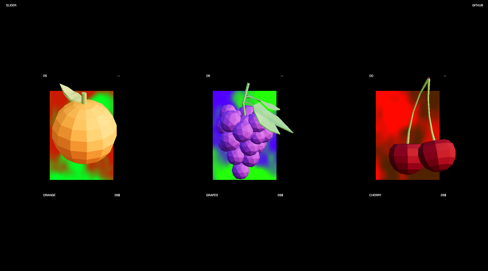

# Three.js Spinning Images



3D Carousel/Slider combining Three.js and DOM elements.

Live Demo: [3d-slider-bay.vercel.app](https://3d-slider-bay.vercel.app)

## Technologies Used

- React
- Vite
- Three.js / React Three Fiber
- Drei

## Installation

1. Clone the repository:

```bash
git clone https://github.com/SebastianKullander9/3d-slider.git
cd 3d-slider
```

2. Install dependencies:

```bash
npm install
```

3. Start the development server:

```bash
npm run dev
```
